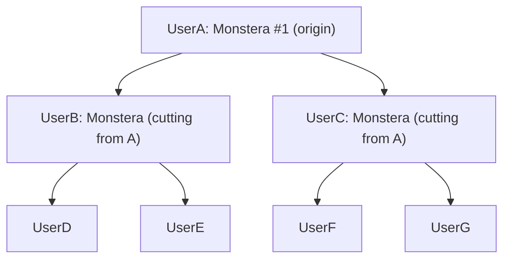

# Propagate Marketplace Implementation Plan

**Overall Progress:** `100%`

## TLDR
Bootstrap a full-stack barter/donation marketplace for gardeners called **Propagate**. Users maintain a library of their plants, list cuttings/seeds for local pickup, claim others' listings, and every completed exchange creates a parent-child edge in a propagation lineage tree. A social layer (notes + feed + follows) lets the community share care tips per plant and follow other gardeners.

Stack is fixed by the project's [tech-stack skill](../.cursor/skills/tech-stack/SKILL.md): Next.js + TypeScript in `web/`, Python FastAPI in `api/`, local PostgreSQL via Homebrew, no Docker.

## Critical Decisions

- **Lineage model: parent-pointer on `plant_instances`** - Each plant a user owns is a row; completing an exchange creates a new row for the receiver with `parent_id` pointing at the donor's row. Tree queries use a Postgres recursive CTE. Lineage integrity falls out of the marketplace flow rather than requiring a separate manual graph.
- **Local pickup only** - Listings carry `lat/lng` + city; search uses simple Haversine in SQL. No shipping or payment fields.
- **Strictly free (donation + barter), no money** - Exchange flow is `request -> accept -> complete`. An optional `offered_listing_id` on a request supports barter ("I'll trade my mint cutting for yours"). No Stripe, no payment provider.
- **Auth: FastAPI-issued JWT, email + password** - `passlib[bcrypt]` for hashing, `python-jose` for JWT, stored client-side in an httpOnly cookie set by a thin Next.js route handler. No third-party SSO in v1.
- **Plant identification: hybrid** - Every `plant_instance` has free-text `common_name` (always required, simplest UX). It also has an optional `species_id` FK to a curated `plant_species` table. The species table can ship empty and be populated incrementally; nothing in the MVP flow blocks on it.
- **Messaging: thread-per-request, polling** - Each request opens a message thread. Frontend polls every few seconds. WebSockets deferred.
- **Photos: local filesystem in dev** - `api/uploads/` served at `/static/`; cloud storage deferred to deployment.
- **Migrations: Alembic** - Per the tech-stack skill.
- **Lineage visualization: react-d3-tree** - Mature, simple tree renderer; consumes the ancestors/descendants payload from the API.
- **Social MVP scope: notes + feed + follows only** - No comments, no likes. Keeps the social surface area small; can be added later.

## Lineage Concept

Each node is a row in `plant_instances`. Each edge is a completed `exchanges` row that produced the child node.

## Repository Layout (target)

- `web/` Next.js App Router + TypeScript
- `api/` FastAPI + SQLAlchemy + Alembic, virtualenv at `api/.venv`
- `api/uploads/` local image storage (gitignored)
- `docs/propogate-marketplace-plan.md` this plan
- Root `README.md` updated with macOS run instructions

## Data Model (summary)

- `users` (id, email, password_hash, display_name, bio, city, lat, lng, created_at)
- `plant_species` (id, scientific_name, common_name, created_at) — curated, can be empty in MVP
- `plant_instances` (id, owner_id, species_id NULLable -> plant_species, common_name, variety, nickname, notes, photo_url, parent_id NULLable -> plant_instances, origin_user_id, created_at)
- `listings` (id, owner_id, plant_instance_id, type ENUM[cutting,seed], title, description, photo_url, lat, lng, status ENUM[available,reserved,completed,cancelled], created_at)
- `requests` (id, listing_id, requester_id, message, offered_listing_id NULLable, status ENUM[pending,accepted,declined,completed,cancelled], created_at)
- `exchanges` (id, request_id, donor_id, recipient_id, donor_plant_instance_id, recipient_plant_instance_id, completed_at)
- `messages` (id, request_id, sender_id, body, created_at)
- `plant_notes` (id, plant_instance_id, author_id, body, visibility ENUM[private,public], created_at)
- `posts` (id, author_id, plant_instance_id NULLable, body, photo_url, created_at)
- `follows` (follower_id, followee_id, created_at, PK(follower_id, followee_id))

## Tasks

- [x] 🟩 **Step 1: Preflight & Bootstrap**
  - [x] 🟩 Verify `node`, `npm`, `python3`, `pip`, `brew` are present (per [tech-stack skill](../.cursor/skills/tech-stack/SKILL.md))
  - [x] 🟩 Install + start `postgresql@16` via Homebrew
  - [x] 🟩 Create local DB, role, and `.env` files for `api/` (`DATABASE_URL`, `JWT_SECRET`) and `web/` (`NEXT_PUBLIC_API_URL`)
  - [x] 🟩 Update root `.gitignore` for `.venv/`, `node_modules/`, `.next/`, `api/uploads/`, `.env*`

- [x] 🟩 **Step 2: Scaffold API (FastAPI + venv)**
  - [x] 🟩 `python -m venv api/.venv`; `requirements.txt` with `fastapi`, `uvicorn`, `sqlalchemy`, `psycopg[binary]`, `alembic`, `pydantic-settings`, `passlib[bcrypt]`, `python-jose[cryptography]`, `python-multipart`
  - [x] 🟩 App skeleton: `api/app/main.py`, `api/app/db.py`, `api/app/config.py`, `api/app/models/`, `api/app/routers/`, `api/app/schemas/`, `api/app/deps.py`
  - [x] 🟩 `/health` endpoint
  - [x] 🟩 Initialize Alembic at `api/alembic/`

- [x] 🟩 **Step 3: Scaffold Web (Next.js + TS)**
  - [x] 🟩 `npx create-next-app web --ts --app --eslint --tailwind --src-dir`
  - [x] 🟩 API client wrapper at `web/src/lib/api.ts` with cookie-based auth
  - [x] 🟩 Base layout, nav shell, theming
  - [x] 🟩 Add `react-d3-tree` for lineage view

- [x] 🟩 **Step 4: Data Model & Migrations**
  - [x] 🟩 SQLAlchemy models for all entities listed above (incl. `plant_species`)
  - [x] 🟩 First Alembic migration `0001_init` creating all tables, enums, indexes (incl. `idx_listings_lat_lng`, `idx_plant_instances_parent_id`, `idx_plant_instances_species_id`)
  - [x] 🟩 Seed script `api/scripts/seed.py` with a few users, plants, listings (and optionally a handful of `plant_species` rows) for dev

- [x] 🟩 **Step 5: Auth**
  - [x] 🟩 `POST /auth/register`, `POST /auth/login`, `POST /auth/logout`, `GET /auth/me`
  - [x] 🟩 JWT issuance + bcrypt hashing; `get_current_user` dependency
  - [x] 🟩 Web pages: `/register`, `/login`, profile dropdown; httpOnly cookie set via Next.js route handler proxy

- [x] 🟩 **Step 6: Plant Library (with optional species link)**
  - [x] 🟩 CRUD endpoints under `/plants` for `plant_instances` (only owner can mutate)
  - [x] 🟩 `GET /species?q=` typeahead endpoint backed by `plant_species` (empty results are fine in MVP)
  - [x] 🟩 Photo upload to `api/uploads/`, served at `/static/`
  - [x] 🟩 Web pages: `/library`, `/library/new`, `/library/[id]` with photo, common_name, optional species picker, nickname, notes

- [x] 🟩 **Step 7: Marketplace Listings**
  - [x] 🟩 `POST /listings` (must reference a `plant_instance` you own), `GET /listings` with filters (`q`, `type`, `near=lat,lng,radius_km`), `GET /listings/[id]`, `PATCH/DELETE`
  - [x] 🟩 Haversine SQL for distance filter
  - [x] 🟩 Web pages: `/marketplace` (list + filters + location chip), `/marketplace/[id]`, `/marketplace/new`

- [x] 🟩 **Step 8: Request / Exchange Flow (creates lineage)**
  - [x] 🟩 `POST /listings/{id}/requests` (optional `offered_listing_id` for barter)
  - [x] 🟩 `POST /requests/{id}/accept` -> sets listing `reserved`
  - [x] 🟩 `POST /requests/{id}/complete` -> creates `recipient_plant_instance` with `parent_id = donor_plant_instance_id`, copies through `species_id` and `origin_user_id`; writes `exchanges` row; marks listing `completed`
  - [x] 🟩 `POST /requests/{id}/decline|cancel`
  - [x] 🟩 Web: request modal on listing page; "My requests" inbox at `/inbox`

- [x] 🟩 **Step 9: Lineage API + Visualization**
  - [x] 🟩 `GET /plants/{id}/lineage` - recursive CTE returning ancestors and descendants as nested JSON
  - [x] 🟩 Web page `/library/[id]/lineage` rendering `react-d3-tree` from the payload

- [x] 🟩 **Step 10: In-App Messaging (per request thread)**
  - [x] 🟩 `GET /requests/{id}/messages`, `POST /requests/{id}/messages`
  - [x] 🟩 Web: thread panel inside `/inbox/[requestId]` with simple polling (e.g. 4s)

- [x] 🟩 **Step 11: Social - Notes / Care Tips**
  - [x] 🟩 `POST /plants/{id}/notes`, `GET /plants/{id}/notes` (respect visibility)
  - [x] 🟩 Public notes visible on any user's plant detail page

- [x] 🟩 **Step 12: Social - Feed & Follows**
  - [x] 🟩 `POST /follows/{user_id}` / `DELETE`, `GET /users/{id}/followers|following`
  - [x] 🟩 `POST /posts`, `GET /feed` (posts from self + followees, paginated)
  - [x] 🟩 Web pages: `/feed`, `/u/[handle]`, post composer (optionally tag a `plant_instance`)

- [x] 🟩 **Step 13: Skills + README**
  - [x] 🟩 Add concise `.cursor/skills/nextjs/SKILL.md` and `.cursor/skills/fastapi/SKILL.md` per [tech-stack skill](../.cursor/skills/tech-stack/SKILL.md) step 5
  - [x] 🟩 Update root `README.md` with: prerequisites, Postgres setup commands, env vars, run commands for API and web, smoke-test path

- [x] 🟩 **Step 14: Smoke Test**
  - [x] 🟩 `/health` returns 200
  - [x] 🟩 Register two users -> each adds a plant -> User A lists a cutting -> User B requests + accepted + completed -> User B's library shows the new plant -> lineage view on either plant shows the A->B edge -> User B follows User A and sees A's next post in `/feed`

## Out of Scope (v1)

- Payments, shipping, real-time websockets, push notifications, mobile apps, comments / likes on posts, full plant species catalog import (e.g. third-party taxonomy API), deployment / CI / cloud storage. These can be follow-ups.
